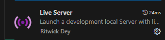

<h1 align="center" >
  
</h1>

<h3 align="center">
  Desafio Front-End
</h3>

<blockquote align="center">Tecnologia que flui!</blockquote>

# Como executar

Este projeto é uma aplicação web para o cadastro de fornecedores e produtos. Para visualizar e interagir com a aplicação, é necessário rodar um servidor web local. Abaixo estão as instruções para configurar e executar um servidor local usando o **Live Server** com Visual Studio Code ou **http-server** via Node.js.

## Configuração do Live Server com Visual Studio Code

1. **Instalação do Visual Studio Code (VS Code)**
   - Se você ainda não tem o VS Code instalado, baixe-o e instale-o a partir do [site oficial](https://code.visualstudio.com/).

2. **Instalação da Extensão Live Server**
   - Abra o VS Code.
   - Vá para a aba de extensões, clicando no ícone de quadrado dividido na barra lateral esquerda ou usando o atalho `Ctrl+Shift+X`.
   - Pesquise por "Live Server" na barra de busca e instale a extensão desenvolvida por *Ritwick Dey*.
  
      

3. **Iniciando o Servidor Local**
   - Abra a pasta do projeto no VS Code.
   - Clique com o botão direito no arquivo `index.html` no explorador de arquivos do VS Code.
   - Selecione a opção "Open with Live Server".
   - Isso abrirá o seu navegador padrão e iniciará o servidor local, servindo o projeto. A URL geralmente será algo como `http://127.0.0.1:5000/` ou `http://localhost:5000/`.

## Configuração do http-server via Node.js (caso você tenha o node JS)

1. **Instalação do Node.js**
   - Se você ainda não tem o Node.js instalado, baixe e instale-o a partir do [site oficial](https://nodejs.org/).

2. **Instalação do http-server**
   - Abra o terminal ou prompt de comando.
   - Execute o seguinte comando para instalar o `http-server` globalmente:
     ```bash
     npm install -g http-server
     ```

3. **Iniciando o Servidor Local**
   - Navegue até a pasta do projeto no terminal:
     ```bash
     cd /caminho/para/sua/pasta
     ```
   - Inicie o servidor executando o comando:
     ```bash
     http-server
     ```
   - O servidor será iniciado e você verá uma mensagem com a URL onde o servidor está rodando, geralmente `http://127.0.0.1:8080` ou `http://localhost:8080`.

4. **Acessando o Projeto**
   - Abra o navegador e acesse a URL fornecida pelo `http-server` para visualizar o projeto.

## Considerações Finais

Utilizando qualquer um desses métodos, o projeto será servido por um servidor web local, permitindo que as requisições para carregar componentes HTML, scripts e outros recursos funcionem corretamente e que o projeto possa ser visualizado corretamente.
